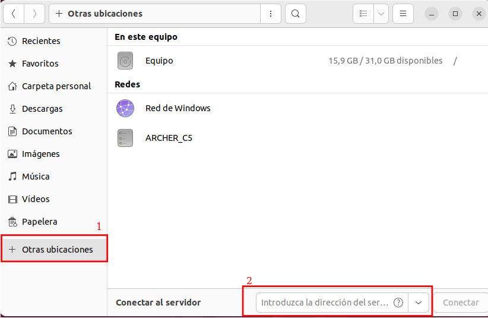
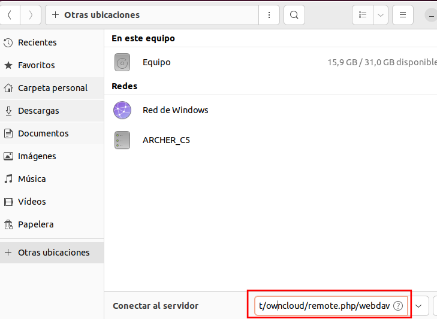
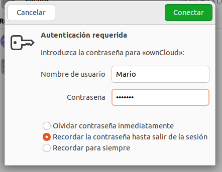
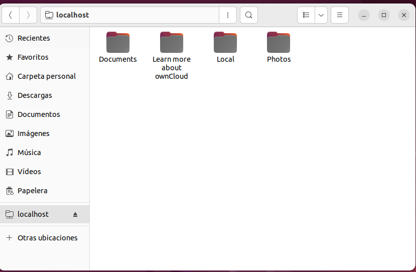
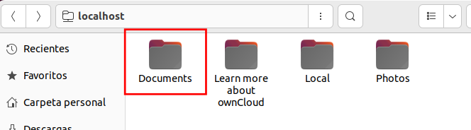

# Activitat-5

### Què és demana:

Fer un mail destinat a un usuari/a del servei, el mail haurà d'estar escrit en llenguatge adient i contindrà:

- [x] Explicació de què és el mail.
- [x] El seu nom d'usuari i contrasenya.
- [x] Instruccions per a instal·lar el servei a un ordinador amb Linux i Windows (amb imatges quan sigui necessari).
- [x] Explicació de com accedir al compte des de l'ordinador.
- [x] Explicació de com sincronitzar els fitxers.
- [x] Explicació de com afegir fitxers i esborrar-los.
- [x] Explicació del límit del compte d'usuari i què fer si s'ha superat.

Es demana fer servir llenguatge formal i adreçar-se a la persona a la que s'està escrivint el mail de vostè.


# Resultat

> **Per a: Empleat1@gmail.com (Mario)**

> **Assumpte: Com funciona el Owncloud**

Hola Mario, hem decidit implementar a la nostra empresa una nova eina de sistemes d'arxius anomenada Owncloud, a continuació et explicare com funciona aquesta aplicació i amb les teves dades que has de introduir a l'hora de iniciar sesio.

```
Usuari: Mario

Contrasenya: 4Cbv76%
```

Per pugue conectarte al teu compte sense entra a l'aplicació en si haurem de entra a una carpeta qualsevol i després en dirigirem a "**otras ubicaciones**" i baix a la dreta hi haura un text que ens dius "**conectar al servidor**".

 

Una vegada clicquem damunt haurem de introduir la seguent ruta "**dav://localhost/owncloud/remote.php/webdav**".



Després d'introduir la ruta et apareixera a la pantalla per posar el usuari i la contrasenya i iniciar sessió. Hauras d'introduir l'usuari i la contrasenya que te he enviat a aquest correu.



Ara que ja has introduit la contrasenya i l'usuari correctament et apareixera una pantall com aquesta:



Finalment a la carpeta de "**Documents**" podras guarda els fitxers que tu vulgues sense la cecessitat d'entrar sempre a l'aplicació, també pots crear-te auna carpeta si vulgues i dins et guardes tota la informació que tu vulgues.



> ***Per si vols afegir algun fitxer o vols esborrar-ho lo que hauras de fer es molt fàcil, a l'hora d'afegir un fitxer pots arrosegar-ho directament o pots fer un copia i pegar de l'arxius, i per esborrar-ho pots fer un clic dret i selecionar "eliminar"***

**⚠ Una cosa molt important es que tu tens un límit d'espai per introduir arxius, que son 600 MB, si veus que necessites més espai el que has de fer es contacta amb mi i dirme el perque necessites més espai, i després jo decidire si et puc introduir més quantitat, i dependra de la necessitat de cada persona que me ho demnana.⚠**

